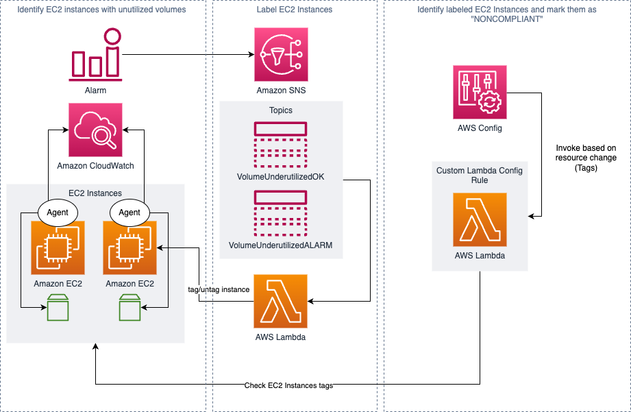

## Prerequisites

Install the CloudWatch Agent on your system and configure a CloudWatch Alarm that pushes alarms to the SNS topics provisioned by the CDK stack.
You should configure both notifications for the "in alarm state" and the "ok state".

Example CloudWatch Agent Config File:
```
{
	"agent": {
		"metrics_collection_interval": 60,
		"run_as_user": "root"
	},
	"metrics": {
		"aggregation_dimensions": [
			[
				"InstanceId"
			]
		],
		"append_dimensions": {
			"AutoScalingGroupName": "${aws:AutoScalingGroupName}",
			"ImageId": "${aws:ImageId}",
			"InstanceId": "${aws:InstanceId}",
			"InstanceType": "${aws:InstanceType}"
		},
		"metrics_collected": {
			"disk": {
				"measurement": [
					"used_percent"
				],
				"metrics_collection_interval": 60,
				"resources": [
					"*"
				]
			},
			"mem": {
				"measurement": [
					"mem_used_percent"
				],
				"metrics_collection_interval": 60
			}
		}
	}
}
```

# Solution Overview



## Components

The Solution is made of two stacks. First the "lib/underutilized-volumes-stack.ts", which is responsible for tagging the apropriate EC2 instance for which it either received a message on the "OK" or "ALARM" Topic. The tag "VolumeUnderutilized" identifies the EC2 instance as a resource which is not using it's allocated volume space to a certain degree.

The second component is the Custom AWS Config Rule("lib/custom-config-rule-underutilized-volumes-stack.ts"), whichs job is to identify "COMPLIANT" and "NONCOMPLIANT" resources. This gives a single view of all instances in an account, that do not efficiently use their storage space.

## How it works

1. The CloudWatch Agent reports metrics for the used disk space
2. CloudWatch fires an alarm once the metrics go below a certain percentage threshold
3. CloudWatch sends an alarm message to the SNS Topic
4. The Lambda Function in "lib/underutilized-volumes-stack.ts" runs, and depending on which topic the Lambda Function was triggered, it labels the ECS instance either as "VolumeUnderutilized":"True" or "VolumeUnderutilized":"False".
5. The fact that the Lambda Function from the previous step just changed the tagging configuration of the EC2 instance, lets AWS Config trigger the Custom Config Rule.
6. The Custom Config Rule then determines if the tag value for VolumeUnderutilized is True or False and, depending on the result, registers the EC2 instance as a "COMPLIANT" or "NONCOMPLIANT" resource.
